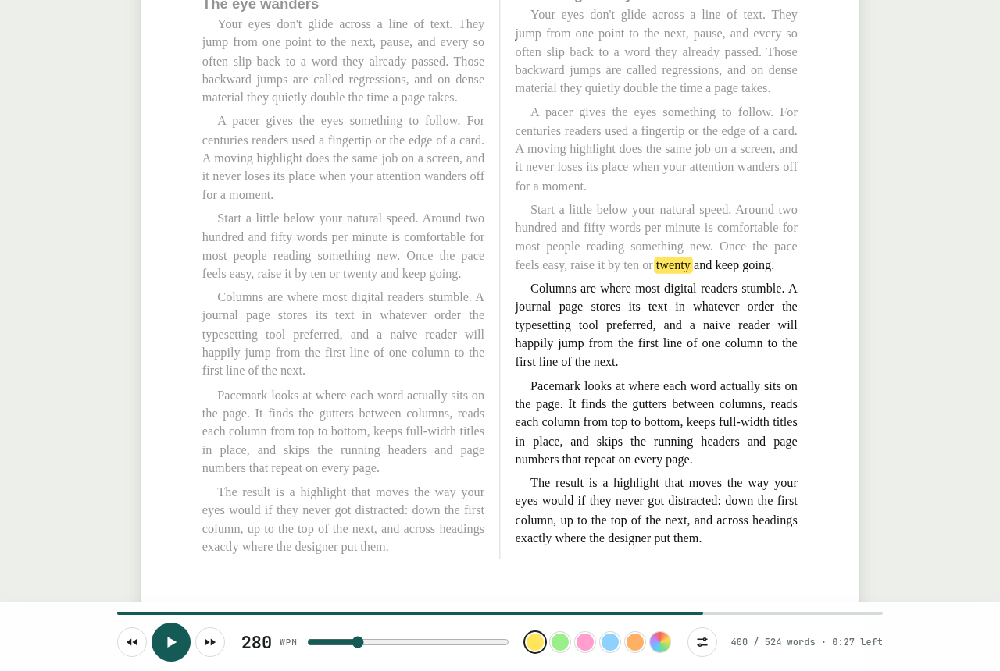
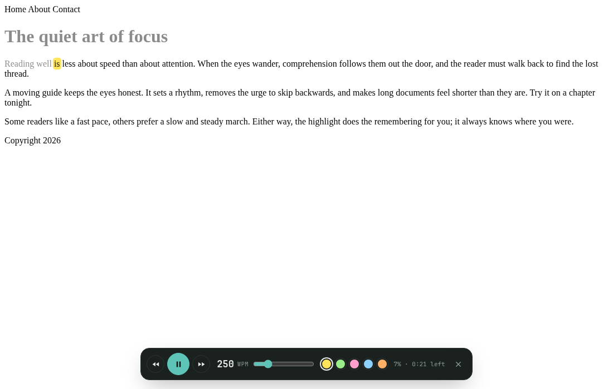

<p align="center">
  
</p>

<h1 align="center">Pacemark</h1>

<p align="center">
  A highlighter that moves through your PDFs, Word documents and webpages at the reading speed you choose.
</p>

<p align="center">
  <a href="https://adityamittal-dot.github.io/pacemark/"><b>Open the web app</b></a> ·
  <a href="https://github.com/adityamittal-dot/pacemark/releases/latest">Download</a> ·
  <a href="#chrome-extension">Chrome extension</a>
</p>

<p align="center">
  <a href="https://github.com/adityamittal-dot/pacemark/actions/workflows/ci.yml"></a>
  <a href="https://github.com/adityamittal-dot/pacemark/releases/latest"></a>
  <a href="LICENSE"></a>
</p>



## Why

Your eyes don't glide across a line. They jump, stall and slip back to words they already passed, and
on a dense document your attention drifts with them. A pacer, which used to be a finger or the edge of
a card, gives your eyes something to follow. Pacemark does this with a moving highlight. You set the
speed, it keeps the rhythm and remembers where you are.

## Features

- **Reads what you have:** PDF, Word (`.docx`), Markdown, HTML and plain-text files, or pasted text.
- **PDFs keep their look:** pages appear exactly as designed and the highlighter moves over the real words.
- **Understands layouts:** multi-column papers and magazines are read column by column; running headers, footers and page numbers are skipped.
- **Speed from 60 to 1000 WPM**, with optional longer pauses at commas and full stops so it reads like speech, not a metronome.
- **Your highlighter:** five marker colors or any custom color; marker, underline or outline styles; one to three words at a time.
- **Smooth auto-scroll:** the page glides as the highlight nears the bottom, so the line you're reading stays near the middle.
- **Click any word** to start there. Skip by sentence, scrub the progress bar, dim the words you've read.
- **Remembers your place** in every file and keeps your settings on your device.
- **Private and offline:** documents never leave your browser. The app installs and works with no connection.
- **Chrome extension** that highlights any article in place, plus a one-click hand-off for PDFs.

## Use it

### In the browser
Open **[adityamittal-dot.github.io/pacemark](https://adityamittal-dot.github.io/pacemark/)**, then drop a file onto the page.

### Install as an app
In Chrome or Edge, open the web app and choose **Install** in the address bar. Pacemark then opens in its own
window, works offline, and appears under **Open with** for PDF, Word and text files.

### Download and run offline
Grab `pacemark-app-vX.Y.Z.zip` from the [latest release](https://github.com/adityamittal-dot/pacemark/releases/latest),
unzip it and open `index.html`. No server or install needed.

### Chrome extension



1. Download `pacemark-extension-vX.Y.Z.zip` from the [latest release](https://github.com/adityamittal-dot/pacemark/releases/latest) and unzip it.
2. Open `chrome://extensions` and turn on **Developer mode** (top right).
3. Click **Load unpacked** and select the unzipped folder.
4. Pin Pacemark from the puzzle-piece menu.

Then on any article:

- Click the Pacemark icon and choose **Highlight this page**, or press <kbd>Alt</kbd>+<kbd>Shift</kbd>+<kbd>P</kbd>.
- Select a word first to start from there, or right-click and choose **Highlight from here with Pacemark**.
- On a PDF tab, the button changes to **Read this PDF in Pacemark** and opens it in the full reader.
  For PDFs on your own computer, turn on **Allow access to file URLs** on the extension's details page.

The extension works in Chrome, Edge, Brave, Arc and other Chromium browsers.

## Keyboard

| Key | Action |
| --- | --- |
| <kbd>Space</kbd> | Play / pause |
| <kbd>←</kbd> <kbd>→</kbd> | Previous / next word |
| <kbd>Shift</kbd> + <kbd>←</kbd> <kbd>→</kbd> | Previous / next sentence |
| <kbd>↑</kbd> <kbd>↓</kbd> | Speed ±10 WPM |
| <kbd>Esc</kbd> | Stop highlighting (extension) |
| <kbd>Alt</kbd>+<kbd>Shift</kbd>+<kbd>P</kbd> | Start / stop on the current page (extension; change it at `chrome://extensions/shortcuts`) |

## How the pacing works

Each word gets `60 000 / WPM` milliseconds. With **Pause at punctuation** on, a word ending a sentence
holds twice as long, a comma, colon or dash 1.45×, and words longer than nine letters a little extra. The
timer corrects for drift, so the highlight doesn't fall behind over a long chapter.

PDFs are drawn with [pdf.js](https://mozilla.github.io/pdf.js/), and every word gets a box at its exact
position on the page. Reading order comes from the layout, not from the order text is stored in the file:

1. Word pieces are merged, and words are grouped into lines that never cross a column gap.
2. Wherever a clean vertical gutter runs through a region, the left side is read before the right.
3. Where a few lines cross the gutter (a full-width title, figure caption or footnote), the region is split
   above and below them, so those lines stay in place between the column sections.
4. Text that repeats in the top or bottom margin across pages (running headers, footers, page numbers)
   and tiny print such as figure labels is skipped.

Scanned PDFs contain images rather than text, so they need OCR first. If a layout ever reads in the
wrong order, switch **PDF view** to *Plain text* to see the order Pacemark worked out, and please
[open an issue](https://github.com/adityamittal-dot/pacemark/issues) with the file.

## Development

No framework and no build step for the app itself.

```bash
git clone https://github.com/adityamittal-dot/pacemark.git
cd pacemark
npm start        # serve the web app at http://localhost:5173
npm run build    # package dist/pacemark-extension/ and the release zips
```

See [CONTRIBUTING.md](CONTRIBUTING.md) for the project layout and release process.

## Privacy

Nothing is collected or uploaded. See [PRIVACY.md](PRIVACY.md).

## License

[MIT](LICENSE) © 2026 Aditya Mittal. Bundles [pdf.js](https://github.com/mozilla/pdf.js) (Apache-2.0) and
[mammoth.js](https://github.com/mwilliamson/mammoth.js) (BSD-2-Clause).
